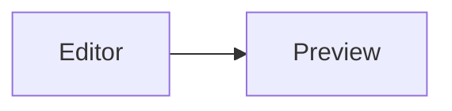

# GLFM rendering test

Every construct this plugin handles, plus the cases that must be left alone.
Open the preview: nothing in the first two sections should still look like raw
GitLab syntax, and everything in "Must stay literal" should.

[[_TOC_]]

## Collapsible sections

::: details With blank lines — full Markdown inside

This body renders **completely**: `code`, [links](https://gitlab.com), and lists.

- one
- two

:::

::: details Without blank lines — raw text, line breaks kept
this body keeps its line breaks
but stays plain text
:::

::: details Empty body
:::

::: details Outer block

Nested blocks close against their own marker, not the first one seen.

::: details Inner block

The inner body.

:::

Still inside the outer block.

:::

## Table of contents

The heading list at the top came from `[[_TOC_]]`. The bracket-only spelling
works too — this one is live:

[TOC]

## Multiline blockquote

>>>
This whole block is one quote.

It survives across paragraphs, unlike three separate `>` lines.
>>>

## Inline diffs

The flag was {-disabled-} and is now {+enabled+}.

Square-bracket spelling: moved from [-old-] to [+new+].

Markup inside a diff survives, and references inside it still link:
{+added **bold**, a `code` span, [a link](https://gitlab.com) and #123+}.

## Colour chips

Six-digit `#f4511e`, three-digit `#fa0`, eight-digit `#1f1e2480`,
four-digit `#fa0c`, `rgb(31, 30, 36)`, `rgba(31, 30, 36, 0.5)`,
`hsl(210, 90%, 55%)` and `hsla(210, 90%, 55%, 0.4)`.

## Emoji

Shipped :tada: — tests green :white_check_mark:, one :bug: left, ship it :rocket:

## Task list

- [x] done
- [ ] outstanding
- [~] inapplicable
- plain item, no checkbox

Nested:

- parent
  - [~] nested inapplicable

## Footnotes

CommonMark has no footnotes[^1], so the plugin adds them[^why]. The first is
referenced twice[^1] to prove numbering follows first use.

[^1]: The IDE parser does not implement them.
[^why]: Because GitLab renders them and the preview should match.

## Audio and video

GitLab renders these as players. The preview cannot: its Content Security
Policy forbids loading media, so they become links instead.

## References

These need a GitLab remote, or a project URL set in the plugin settings.

- issue #123, merge request !45, snippet $6
- milestone by number %7, milestone by name %"Q3 Launch"
- epic &8
- label ~backend, scoped label ~"needs review"
- user @someone
- cross-project group/other#99

## Heading anchors

Headings get ids, so [this link jumps to Emoji](#emoji) and so does the table of
contents above. Each heading also gets a permalink, shown on hover at the end of
the heading text — and it must not leak into the table of contents above.

---

## Already handled by the IDE

Not this plugin's job — listed so a regression here is obviously not mine.

| Feature               | Rendered by              |
|-----------------------|--------------------------|
| tables                | platform (GFM)           |
| ~~strikethrough~~     | platform (GFM)           |
| math                  | bundled Markdown plugin  |
| mermaid               | bundled Mermaid plugin   |
| definition lists      | platform                 |
| front matter (hidden) | platform                 |

Term
: Definition lists are a platform feature.

> [!NOTE]
> Alerts are rendered by the platform, not by this plugin.

## Must stay literal

Nothing below should be transformed.

- unknown emoji: :notarealemoji:
- footnote with no definition: [^ghost]
- a definition nothing references, which must stay visible:

[^unused]: Nothing points at this one.
- an email address: someone@example.com
- a C# heading reference in prose: C# and F#
- references inside code: `#123`, `~label`, `@someone`, `!45`
- a colour-looking word: `#define`, `rgb-value`
- an unterminated details block:

::: details This one never closes

so the marker above must remain visible.
